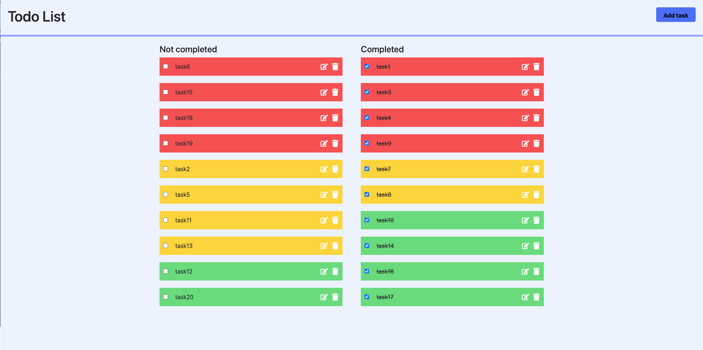
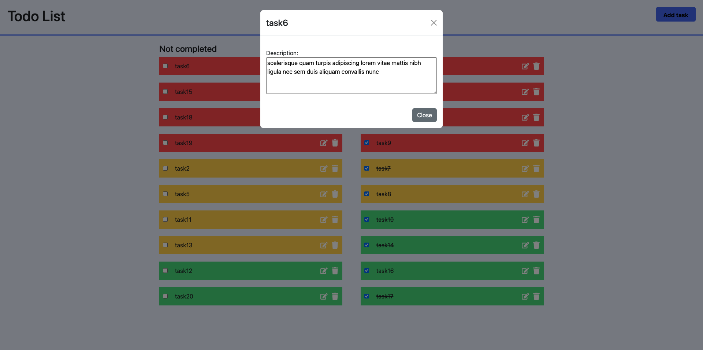
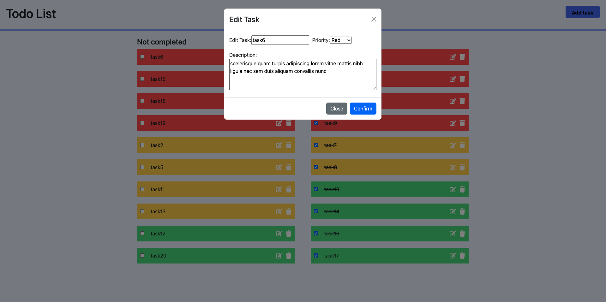
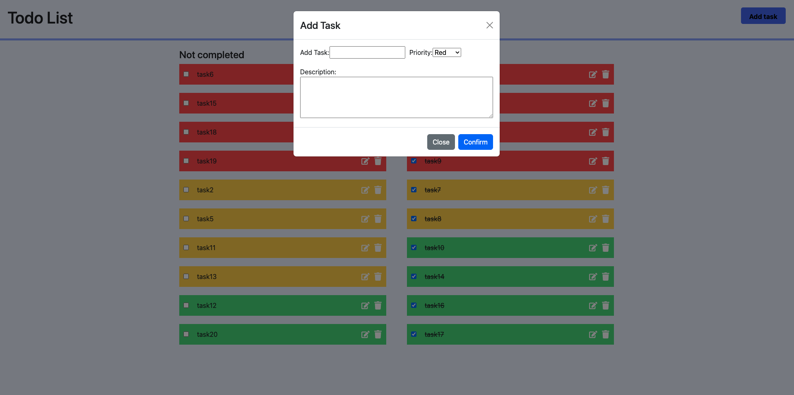

U ovom zadatku potrebno je kreirati aplikaciju koja ispunjava jednu ili vise od ovih tacaka, mozete izabrati i par tacaka koje mislite da mozete da uradite, nije neophodno ih uradite po redu.

Zadatak mozete da radite u jeziku po svom izboru

Neophodno je da komitujete blagovremeno, kako budete napredovali sa zadatkom, nemojte samo da kreirate jedan komit i da pushujete sve.
Takodje, **nemojte pushovati node_modules folder**

Zadatak koji treba da uradite je da napravite todo listu

- Zadatak treba da ispunjava sledece kriterijume
- kao korisnik, zeleo bih da imam mogucnost da dodam todo, obrisem i markiram kao completed, markirani kao completed treba da stoje u posebnoj koloni
  - svaki todo treba ima naslov, opis i prioritet
  - sortirati po prioritetu, grupisati po completed / not completed
  - zadatak mozete uraditi u sledecim tehnologijama
- perzistirati stanje aplikacije u local storage ili u bazu podataka
- dodati TypeScript
- dodati autentifikaciju

Minimalni kriterijumi su da imamo funkcionalnu todo listu kao i da moze da se izbuilduje sa dockerom.

Sav kod treba pushovati na ovaj forkovani repozitorijum, iako je repozitorijum podesen na private, nije neophodno promeniti na public.

## Features

- Add, edit, and remove tasks
- Read task descriptions
- Choose priority
- Sort by priority: Red (high), Yellow (mid), Green (low)

## Screenshots









## Installation

Clone the repository and install dependencies.

```bash
git clone https://github.com/top17/Zadatak-za-praksu.git
cd Zadatak-za-praksu
npm install
npm run dev
```

## Docker

Build and run the Docker image:

```bash
docker build -t zadatak-za-praksu .
docker run -p 5173:5173 -p 8000:8000 zadatak-za-praksu
```
